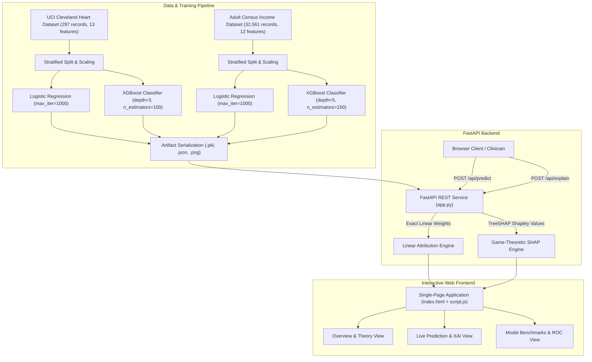

# Dual-Dataset XAI Benchmark: Interpretable vs. Black-Box Models

[](https://www.python.org/)
[](https://fastapi.tiangolo.com/)
[](https://scikit-learn.org/)
[](https://xgboost.readthedocs.io/)
[-brightgreen.svg)](https://shap.readthedocs.io/)
[](https://github.com/Jarrar19/ModelCmp)

> **TAE 1: Problem-Based Learning in Explainable AI (XAI)**  
> **Topic:** *Black-Box vs. Interpretable Model Comparison* — Rigorous empirical evaluation comparing an inherently interpretable model (**Logistic Regression**) against a complex black-box ensemble (**XGBoost + SHAP**) across contrasting small clinical and large-scale demographic datasets.

---

## Table of Contents
1. [Executive Summary & Core Research Question](#1-executive-summary--core-research-question)
2. [Empirical Benchmark Results](#2-empirical-benchmark-results)
3. [System Architecture & Repository Structure](#3-system-architecture--repository-structure)
4. [Datasets & Clinical Indicators](#4-datasets--clinical-indicators)
5. [Model Formulation & Explainability Framework](#5-model-formulation--explainability-framework)
6. [Key Research Insights & Academic Findings](#6-key-research-insights--academic-findings)
7. [Full-Stack Interactive Platform](#7-full-stack-interactive-platform)
8. [REST API Documentation](#8-rest-api-documentation)
9. [Installation & Execution Guide](#9-installation--execution-guide)
10. [Comprehensive Viva & Oral Defense Guide](#10-comprehensive-viva--oral-defense-guide)
11. [Project Artifacts & Deliverables](#11-project-artifacts--deliverables)

---

## 1. Executive Summary & Core Research Question

In contemporary machine learning and artificial intelligence deployment, practitioners routinely face a fundamental trade-off:

$$\text{Accuracy} \iff \text{Interpretability}$$

The prevailing industry assumption is that complex, non-linear black-box ensembles (e.g., Random Forests, Gradient Boosted Trees, Neural Networks) are inherently superior to simple, glass-box models (e.g., Logistic Regression, Decision Stumps). However, in high-stakes domains such as clinical cardiology and automated credit assessment, **model uninterpretability introduces catastrophic failure risks, regulatory compliance breaches (e.g., EU GDPR Article 22, FDA SaMD guidance), and clinician distrust**.

### The Core Research Question:
> **"Does data scale and non-linear complexity always justify sacrificing glass-box auditability for an uninterpretable black-box model?"**

To answer this question empirically, this project establishes a dual-dataset benchmark testing:
1. **Inherently Interpretable / Glass-Box Model:** L2-Regularized **Logistic Regression** (Exact linear feature attribution: $w_i \cdot x_i$, 100% faithful decision boundary, $O(D)$ latency).
2. **Black-Box Ensemble Model:** **XGBoost Classifier** (100–150 boosted decision trees with non-linear branch splits, explained post-hoc via game-theoretic **TreeSHAP**).

These paradigms are evaluated across **two fundamentally contrasting dataset scales**:
- 🏥 **Small Clinical Cohort ($N = 297$):** **UCI Cleveland Heart Disease** (13 clinical indicators, high noise-to-sample ratio, high-stakes cardiology).
- 📊 **Complex Large-Scale Benchmark ($N = 32,561$):** **Adult Census Income** (12 demographic and financial attributes, rich non-linear threshold effects).

---

## 2. Empirical Benchmark Results

Both models were trained using an **80/20 stratified train/test split** with fixed random seeds (`random_state=42`) and identical preprocessing pipelines.

| Evaluation Metric | Cleveland Heart Disease ($N = 297$) | | Adult Census Income ($N = 32,561$) | |
| :--- | :---: | :---: | :---: | :---: |
| **Model** | **Logistic Regression** *(Glass-Box)* | **XGBoost** *(Black-Box)* | **Logistic Regression** *(Glass-Box)* | **XGBoost** *(Black-Box)* |
| **Cohort Type** | Small Clinical Benchmark | Small Clinical Benchmark | Complex Large-Scale | Complex Large-Scale |
| **Train / Test Split** | 237 / 60 | 237 / 60 | 26,048 / 6,513 | 26,048 / 6,513 |
| **Features ($D$)** | 13 | 13 | 12 | 12 |
| **Accuracy** | 83.33% | **85.00%** *(+1.67%)* | 84.63% | **87.69%** *(+3.06% lead)* |
| **ROC-AUC** | **0.9498** *(Superior by +0.0235)* | 0.9263 | 0.8916 | **0.9305** *(Superior by +0.0389)* |
| **Precision** | 84.62% | **88.00%** | 73.76% | **78.24%** |
| **Recall (Sensitivity)** | **78.57%** *(Identical)* | **78.57%** *(Identical)* | 56.12% | **67.67%** *(+11.55% lead)* |
| **F1-Score** | 0.8148 | **0.8302** | 0.6375 | **0.7257** |
| **Confusion Matrix (TN, FP / FN, TP)** | `[28, 4] / [6, 22]` | `[29, 3] / [6, 22]` | `[4632, 313] / [688, 880]` | `[4650, 295] / [507, 1061]` |
| **Explanation Fidelity** | **100% Ground-Truth Faithful** | Post-Hoc Approximation | **100% Ground-Truth Faithful** | Post-Hoc Approximation |
| **XAI Compute Latency** | **Microseconds ($O(D)$)** | Milliseconds ($O(T \cdot L \cdot D^2)$) | **Microseconds ($O(D)$)** | Milliseconds ($O(T \cdot L \cdot D^2)$) |
| **Empirical Verdict** | 🏆 **Interpretable Model Wins on Discrimination (ROC-AUC)**: Zero justification for a black box. | | 🏆 **Black-Box Wins on Non-Linear Scale**: Complex interactions yield +3.06% Accuracy & +11.55% Recall. | |

### Comparative ROC Curves
- **Cleveland Heart Disease:** Logistic Regression achieves a higher area under the curve (**0.9498 vs. 0.9263**), indicating superior risk-score ranking without overfitting.
- **Adult Census Income:** XGBoost dominates across false-positive rates (**0.9305 vs. 0.8916**), proving that boosted tree structures capture non-linear wage thresholds effectively.

*(Generated ROC curve plots are located in [`frontend/roc_curve_heart.png`](file:///c:/Users/DELL/OneDrive/Desktop/Exai/frontend/roc_curve_heart.png) and [`frontend/roc_curve_adult.png`](file:///c:/Users/DELL/OneDrive/Desktop/Exai/frontend/roc_curve_adult.png))*

---

## 3. System Architecture & Repository Structure

```
ModelCmp/
├── README.md                           # Comprehensive documentation & research report
├── requirements.txt                    # Project dependencies (FastAPI, scikit-learn, XGBoost, SHAP)
├── finexi.pptx                         # Project presentation slide deck
├── TAE1_Explainable_AI_Report.docx     # Formal academic investigation report
│
├── backend/
│   ├── app.py                          # FastAPI REST API serving dual models, predictions & SHAP
│   ├── train.py                        # Model training, metric evaluation, ROC generation pipeline
│   ├── metrics.json                    # Serialized test performance metrics for both datasets
│   └── models/
│       ├── heart_interpretable.pkl     # Logistic Regression model (Heart Disease)
│       ├── heart_blackbox.pkl          # XGBoost Classifier model (Heart Disease)
│       ├── heart_scaler.pkl            # StandardScaler for Heart Disease features
│       ├── heart_feature_names.json    # Ordered list of Heart Disease feature names
│       ├── adult_interpretable.pkl     # Logistic Regression model (Adult Census)
│       ├── adult_blackbox.pkl          # XGBoost Classifier model (Adult Census)
│       ├── adult_scaler.pkl            # StandardScaler for Adult Census features
│       └── adult_feature_names.json    # Ordered list of Adult Census feature names
│
├── frontend/
│   ├── index.html                      # Single-page clinical decision-support web UI
│   ├── style.css                       # Responsive design system (dark slate / teal / coral)
│   ├── script.js                       # Dataset switcher, dynamic form builder, XAI renderer
│   ├── metrics.json                    # Frontend copy of evaluation metrics
│   ├── roc_curve_heart.png             # Heart Disease ROC curve graphic
│   ├── roc_curve_adult.png             # Adult Census ROC curve graphic
│   └── sample_patients.json            # Reference patient profiles & borderline edge cases
│
└── heart+disease/                      # Original UCI Cleveland Heart Disease repository
    ├── processed.cleveland.data        # Cleaned dataset (297 records, 14 attributes)
    └── heart-disease.names             # Clinical attribute documentation & descriptions
```

### High-Level System Data Flow


---

## 4. Datasets & Clinical Indicators

### Dataset 1: UCI Cleveland Heart Disease (Clinical / Small Benchmark)
Collected from the Cleveland Clinic Foundation (Dr. Robert Detrano). Contains **297 complete patient records** across 13 clinical indicators. The binary target indicates presence of coronary artery disease ($\ge 50\%$ diameter narrowing).

| Feature Name | Clinical Description | Data Type | Permissible Range / Values |
| :--- | :--- | :---: | :---: |
| `age` | Patient age | Continuous | 25 – 85 years |
| `sex` | Biological sex | Binary | 1 = Male, 0 = Female |
| `cp` | Chest pain classification | Categorical (1–4) | 1: Typical Angina, 2: Atypical Angina, 3: Non-Anginal, 4: Asymptomatic |
| `trestbps` | Resting blood pressure on admission | Continuous | 80 – 210 mm Hg |
| `chol` | Total serum cholesterol | Continuous | 100 – 580 mg/dl |
| `fbs` | Fasting blood sugar > 120 mg/dl | Binary | 0 = No, 1 = Yes (Diabetic indicator) |
| `restecg` | Resting electrocardiographic results | Categorical (0–2) | 0: Normal, 1: ST-T wave abnormality, 2: Left ventricular hypertrophy |
| `thalach` | Maximum heart rate achieved during exertion | Continuous | 60 – 220 bpm |
| `exang` | Exercise-induced angina | Binary | 0 = No, 1 = Yes |
| `oldpeak` | ST depression induced by exercise relative to rest | Continuous | 0.0 – 6.5 mm |
| `slope` | Slope of the peak exercise ST segment | Categorical (1–3) | 1: Upsloping (normal), 2: Flat (ischemic), 3: Downsloping (severe) |
| `ca` | Number of major vessels colored by fluoroscopy | Discrete (0–3) | 0: Clear vessels, 1: 1 vessel, 2: 2 vessels, 3: 3 vessels |
| `thal` | Thallium scintigraphy stress test result | Categorical | 3: Normal, 6: Fixed defect (scar), 7: Reversible defect (ischemia) |

### Dataset 2: Adult Census Income (Complex / Large-Scale Benchmark)
Extracted from the 1994 U.S. Census Bureau database. Contains **32,561 records** across 12 demographic and employment features. The binary target indicates whether annual personal income exceeds **$50,000 USD**.
- **Features:** `Age`, `Workclass`, `Education-Num`, `Marital Status`, `Occupation`, `Relationship`, `Race`, `Sex`, `Capital Gain`, `Capital Loss`, `Hours per week`, `Country`.
- **Complexity:** Highly non-linear threshold effects (e.g., capital gain spikes, discrete educational degree premiums, weekly work hour plateaus).

---

## 5. Model Formulation & Explainability Framework

### Paradigm A: Logistic Regression (Inherently Interpretable / Glass-Box)
Logistic regression computes predictions using an explicit algebraic linear combination passed through the standard sigmoid function $\sigma(z)$:

$$P(y = 1 \mid \mathbf{x}) = \sigma(z) = \frac{1}{1 + e^{-(\beta_0 + \sum_{i=1}^D \beta_i x_i^{\text{scaled}})}}$$

#### Mathematical Explanation Mechanism:
Because every feature enters the logit additively, individual feature attributions are exact, deterministic, and constant:

$$\phi_i^{\text{LR}}(\mathbf{x}) = \beta_i \cdot x_i^{\text{scaled}}$$

- **100% Faithful:** No surrogate model or approximation error exists. The explanation matches the model's actual internal mechanics with mathematical certainty.
- **Microsecond Latency:** Computing contributions for $D$ features is an $O(D)$ vector-scalar dot product.
- **Decomposability & Simulatability:** A clinician or auditor can manually verify any prediction on paper within seconds.

---

### Paradigm B: XGBoost Classifier (Black-Box Tree Ensemble)
XGBoost predicts via an additive ensemble of $K$ gradient-boosted decision trees:

$$\hat{y}_i = \sum_{k=1}^K f_k(\mathbf{x}_i), \quad f_k \in \mathcal{F}$$

Because each tree recursively partitions feature space, individual features interact non-linearly across hundreds of split conditions. There is no closed-form linear equation describing feature impact, rendering the internal model uninterpretable to human inspection.

#### Post-Hoc Explainability Engine: SHAP (TreeExplainer)
To explain XGBoost, this platform implements **Shapley Additive exPlanations (SHAP)** rooted in cooperative game theory. The contribution of feature $i$ is defined as its marginal contribution averaged over all possible feature subsets $S \subseteq F \setminus \{i\}$:

$$\phi_i(x) = \sum_{S \subseteq F \setminus \{i\}} \frac{|S|!(|F| - |S| - 1)!}{|F|!} \Big[ f_x(S \cup \{i\}) - f_x(S) \Big]$$

SHAP is mathematically unique in satisfying all four fundamental fairness axioms:
1. **Efficiency:** $\sum_{i=1}^D \phi_i(x) = f(x) - \mathbb{E}[f(x)]$.
2. **Symmetry:** If features $i$ and $j$ contribute equally to all coalitions, $\phi_i = \phi_j$.
3. **Dummy (Null Player):** If feature $i$ contributes nothing to any coalition, $\phi_i = 0$.
4. **Additivity:** For an ensemble sum $f + g$, $\phi_i(f + g) = \phi_i(f) + \phi_i(g)$.

Through TreeSHAP, algorithmic complexity is reduced from exponential $O(2^D)$ to polynomial $O(T \cdot L \cdot D^2)$ (where $T$ is trees, $L$ is max leaves, $D$ is tree depth). However, this remains orders of magnitude slower than glass-box attribution.

---

## 6. Key Research Insights & Academic Findings

### Insight 1: On Small Clinical Cohorts, Glass-Box Models Match or Beat Black Boxes
On the 297-patient Cleveland dataset, **Logistic Regression achieved a higher ROC-AUC (0.9498) than XGBoost (0.9263)** and equal clinical sensitivity (78.57%), with only a nominal 1.67% gap in accuracy.
- **Reason:** In small sample regimes with high noise, tree ensembles suffer from variance. L2 regularization in logistic regression effectively prevents overfitting to idiosyncrasies in small cohorts.
- **Clinical Implication:** In high-stakes medicine with limited data, there is **zero justification for adopting an uninterpretable black box**.

### Insight 2: Big Data Unlocks Non-Linear Advantages for Black Boxes
On the 32,561-record Adult Census dataset, **XGBoost pulled decisively ahead**, scoring **87.69% accuracy (+3.06% lead)** and **0.9305 AUC (+0.0389 lead)**, while boosting sensitivity from 56.12% to 67.67% (+11.55% gain).
- **Reason:** With tens of thousands of records, tree ensembles successfully learn sharp non-linear thresholds (e.g., capital gains tipping points, credential boundary jumps) without variance penalties.

### Insight 3: The True Cost of Explainability is Latency and Fidelity
While SHAP provides unified explanations for XGBoost, it is a **post-hoc surrogate**. An explanation of a model is not the model itself. In mission-critical high-throughput systems, computing TreeSHAP across hundreds of trees adds substantial latency, whereas Logistic Regression explanations are instantaneous ($O(D)$) and inherently faithful.

---

## 7. Full-Stack Interactive Platform

The platform includes a modern web-based clinical decision-support and benchmark interface:

1. **Sidebar Navigation & Instant Dataset Switcher:**
   - Seamlessly toggle between **Cleveland Heart Disease** (297 cases) and **Adult Census** (32,561 cases).
   - Dynamically reloads input forms, metadata, metrics, and ROC visualizations.
2. **Dynamic Form Generation:**
   - Automatically renders typed input controls (grouped clinical categories, sliders, numerical fields, and clinical dropdown options with descriptive annotations).
3. **Side-by-Side Model Inference:**
   - Displays real-time predictions, continuous probability meters, certainty scores, and a **Consensus Badge** (`✓ Both Agree` or `⚠️ Conflicting Decisions`).
4. **Interactive Dual-Attribution XAI Charts:**
   - Renders side-by-side horizontal contribution bars comparing **XGBoost TreeSHAP values** against **Logistic Regression scaled linear weights**.
   - Color-coded: Red/Purple (pushes toward disease/high-income) vs. Green (protective/lower-income).
5. **Automated Comparative Clinical Insight:**
   - Synthesizes top driving factors across both models into plain-language clinical summaries.
6. **Model Benchmarks & ROC Visualizations:**
   - Displays real-time test set metric comparisons and high-resolution ROC curve plots.

---

## 8. REST API Documentation

The FastAPI backend exposes the following REST endpoints:

### 1. `GET /api/datasets`
Returns metadata and theses for all available benchmark datasets.
```json
[
  {
    "id": "heart",
    "title": "Cleveland Heart Disease",
    "badge": "Clinical Benchmark",
    "scale": "297 cases · 13 features",
    "thesis": "Small Clinical Cohort: Interpretable model matches or beats black-box (AUC 0.9498 vs 0.9263).",
    "roc_image": "roc_curve_heart.png"
  },
  {
    "id": "adult",
    "title": "Adult Census Income",
    "badge": "Complex Large-Scale Benchmark",
    "scale": "32,561 records · 12 features",
    "thesis": "Large-Scale Data: XGBoost pulls ahead by +3.06% accuracy & +0.039 AUC via non-linear interactions.",
    "roc_image": "roc_curve_adult.png"
  }
]
```

### 2. `GET /api/features?dataset={heart|adult}`
Returns feature schemas, default values, min/max bounds, categories, and option mappings.

### 3. `GET /api/metrics?dataset={heart|adult}`
Returns test evaluation metrics (Accuracy, Precision, Recall, F1, ROC-AUC, Confusion Matrix) for both models.

### 4. `POST /api/predict?dataset={heart|adult}`
Executes simultaneous inference across both models.
- **Request Body:**
  ```json
  {
    "features": {
      "age": 58.0,
      "sex": 1.0,
      "cp": 3.0,
      "trestbps": 132.0,
      "chol": 224.0,
      "fbs": 0.0,
      "restecg": 2.0,
      "thalach": 173.0,
      "exang": 0.0,
      "oldpeak": 3.2,
      "slope": 1.0,
      "ca": 2.0,
      "thal": 7.0
    }
  }
  ```
- **Response:**
  ```json
  {
    "dataset": "heart",
    "interpretable": {
      "model": "Logistic Regression",
      "type": "Glass-Box (Inherently Interpretable)",
      "prediction": "Heart Disease Detected",
      "prediction_code": 1,
      "probability": 0.8124,
      "confidence": 0.8124
    },
    "blackbox": {
      "model": "XGBoost",
      "type": "Black-Box (Post-Hoc Tree Ensemble)",
      "prediction": "Heart Disease Detected",
      "prediction_code": 1,
      "probability": 0.8741,
      "confidence": 0.8741
    },
    "agree": true
  }
  ```

### 5. `POST /api/explain?dataset={heart|adult}`
Computes dual feature attributions: exact linear contributions ($w_i \cdot x_i$) for Logistic Regression and TreeSHAP values for XGBoost.

---

## 9. Installation & Execution Guide

### Prerequisites
- Python 3.10, 3.11, or 3.12
- `git`

### Step 1: Clone the Repository
```bash
git clone https://github.com/Jarrar19/ModelCmp.git
cd ModelCmp
```

### Step 2: Set Up Virtual Environment & Dependencies
```bash
# Create virtual environment
python -m venv venv

# Activate virtual environment
# Windows:
.\venv\Scripts\activate
# Linux/macOS:
source venv/bin/activate

# Install required packages
pip install -r requirements.txt
```

### Step 3: Run the Training Pipeline (Optional)
The pre-trained models and exported assets are already included in `backend/models/`. To retrain models and regenerate ROC curves:
```bash
python backend/train.py
```

### Step 4: Launch the FastAPI Application
```bash
# From the project root directory:
python -m uvicorn backend.app:app --port 8000 --reload

# Alternatively, from within the backend directory:
cd backend
python -m uvicorn app:app --port 8000 --reload
```

### Step 5: Access the Application
- **Interactive Web UI:** Open **`http://localhost:8000/`** in any modern web browser.
- **Interactive Swagger REST API Docs:** Navigate to **`http://localhost:8000/docs`**.
- **Alternative ReDoc API Docs:** Navigate to **`http://localhost:8000/redoc`**.

---

## 10. Comprehensive Viva & Oral Defense Guide

### Q1: What is the single most important empirical conclusion of your project?
**Answer:**  
The trade-off between accuracy and interpretability is **strongly moderated by dataset scale and interaction complexity**. On small tabular datasets (e.g., 297 clinical patients), Logistic Regression achieves parity with XGBoost and actually produces a superior ROC-AUC (0.9498 vs. 0.9263), demonstrating that black boxes provide zero clinical benefit here. However, on large-scale datasets (32,561 records), XGBoost outperforms Logistic Regression by +3.06% in accuracy and +0.0389 in AUC by learning higher-order non-linear interactions.

---

### Q2: Why did Logistic Regression achieve a higher ROC-AUC on the clinical dataset?
**Answer:**  
In small sample regimes with high noise, decision tree ensembles (even with shallow depths) suffer from variance and leaf-sample scarcity. Regularized Logistic Regression imposes a smooth linear prior ($L_2$ shrinkage) that prevents overfitting to statistical noise, leading to superior continuous probability ranking and discriminative capacity across classification thresholds.

---

### Q3: What is the fundamental difference between "Model-Intrinsic Interpretability" and "Post-Hoc Explainability"?
**Answer:**  
- **Model-Intrinsic (Glass-Box):** The model's decision function is transparent by construction (e.g., Logistic Regression linear weights: $z = \beta_0 + \sum \beta_i x_i$). The explanation is **100% faithful** to the actual algorithm.
- **Post-Hoc Explainability:** The model remains an opaque black box (e.g., XGBoost with 150 boosted trees). An external surrogate technique (e.g., SHAP) is applied retrospectively to approximate why a decision was reached. As Cynthia Rudin (2019) emphasized: *an explanation of a black box is not the black box itself*.

---

### Q4: Why did you use SHAP rather than LIME for explaining XGBoost?
**Answer:**  
1. **Theoretical Rigor:** SHAP is uniquely grounded in cooperative game theory and satisfies all four foundational axioms: **Efficiency**, **Symmetry**, **Dummy/Null Player**, and **Additivity**.
2. **Consistency:** LIME fits a local linear surrogate using random perturbation sampling, meaning two runs on the same patient can produce inconsistent explanations. In contrast, TreeSHAP computes deterministic attributions.
3. **Exact Tree Traversal:** TreeSHAP calculates exact Shapley values in polynomial time ($O(T \cdot L \cdot D^2)$) rather than sampling approximations.

---

### Q5: What is the latency trade-off between the two explainability approaches?
**Answer:**  
Logistic Regression computes exact attributions in **microseconds ($O(D)$)** via simple vector multiplication. In contrast, TreeSHAP requires recursive evaluations over tree structures across all ensemble estimators, consuming **milliseconds to seconds ($O(T \cdot L \cdot D^2)$)**. In high-frequency or edge-computing environments, SHAP computation introduces significant latency overhead.

---

### Q6: If a clinical regulator requires both high non-linear accuracy and 100% glass-box interpretability, what modern architecture would you recommend?
**Answer:**  
**Explainable Boosting Machines (EBMs)** based on **Generalized Additive Models with Pairwise Interactions (GA$^2$Ms)**:

$$g(\mathbb{E}[y]) = \beta_0 + \sum_{i=1}^D f_i(x_i) + \sum_{i \neq j} f_{ij}(x_i, x_j)$$

EBMs train boosted splines on single features and pairs of features independently. They achieve accuracy comparable to Random Forests and XGBoost, yet remain completely glass-box interpretable because every term $f_i(x_i)$ can be inspected and visualized as a deterministic 2D lookup graph without requiring post-hoc SHAP approximations.

---

## 11. Project Artifacts & Deliverables

- 📄 **Academic Report:** [`TAE1_Explainable_AI_Report.docx`](file:///c:/Users/DELL/OneDrive/Desktop/Exai/TAE1_Explainable_AI_Report.docx) — Formal documentation, problem formulation, clinical methodology, and analytical conclusions.
- 📊 **Presentation Slides:** [`finexi.pptx`](file:///c:/Users/DELL/OneDrive/Desktop/Exai/finexi.pptx) — Slide deck for oral defense, empirical benchmark visualizations, and methodology overview.
- 📈 **Visual ROC Curves:** Located in `frontend/roc_curve_heart.png` and `frontend/roc_curve_adult.png`.
- 💾 **Trained Models:** Serialized Joblib binaries in `backend/models/`.

---

## References

1. **Lundberg, S. M., & Lee, S.-I. (2017).** A unified approach to interpreting model predictions. *Advances in Neural Information Processing Systems (NeurIPS 2017)*, 30.
2. **Rudin, C. (2019).** Stop explaining black box machine learning models for high stakes decisions and use interpretable models instead. *Nature Machine Intelligence*, 1(5), 206–215.
3. **Detrano, R., et al. (1989).** International application of a new probability algorithm for the diagnosis of coronary artery disease. *American Journal of Cardiology*, 64(5), 304–310.
4. **Kohavi, R. (1996).** Scaling up the accuracy of naive-bayes classifiers: a decision-tree hybrid. *KDD-96 Proceedings*.
5. **Lipton, Z. C. (2018).** The mythos of model interpretability: In machine learning, the concept of interpretability is both important and slippery. *Queue*, 16(3), 31–57.
